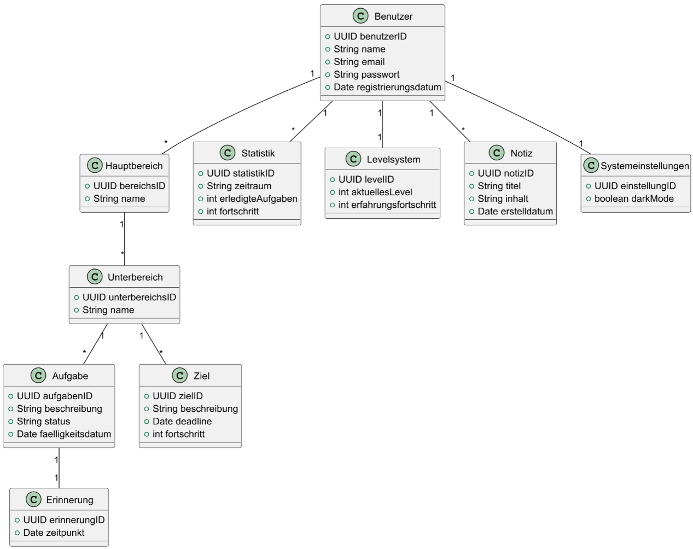

# Realisierungs Konzept

## Inhaltsverzeichnis

1. [Zusammenfassung](#1-zusammenfassung)
2. [Systemanforderungen](#2-systemanforderungen)
   - 2.1 [Anforderungen an die Funktionalität](#21-anforderungen-an-die-funktionalität)
   - 2.2 [Anforderungen an die Informationssicherheit und den Datenschutz](#22-anforderungen-an-die-informationssicherheit-und-den-datenschutz)
3. [Systemarchitektur](#3-systemarchitektur)
   - 3.1 [Systemübersicht](#31-systemübersicht)
   - 3.2 [Gliederung der Lösung](#32-gliederung-der-lösung)
   - 3.3 [Technische Schnittstellen](#33-technische-schnittstellen)
     - 3.3.1 [API-Schnittstelle](#331-api-schnittstelle)
   - 3.4 [Benutzerschnittstelle](#34-benutzerschnittstelle)
4. [Testkonzept - (Testen anhand von User Stories)](#4-testkonzept---testen-anhand-von-user-stories)

### Abbildungsverzeichnis

- **Seite 6:** Fachliche Entitätstypen
- **Seite 8:** Systemübersicht
- **Seite 9:** Gliederung der Lösung
- **Seite 10:** Benutzerschnittstelle

## 1. Zusammenfassung

Der Konzeptbericht im HERMES-Vorgehensmodell dient als wichtige Grundlage für die Umsetzung eines Projekts. Er dokumentiert die fachlichen und technischen Anforderungen und stellt sicher, dass alle Beteiligten ein gemeinsames Verständnis über das Projekt haben. Zudem hilft er, potenzielle Risiken frühzeitig zu erkennen und zu minimieren.

Inhaltlich umfasst der Konzeptbericht unter anderem die Projektziele, Rahmenbedingungen, Systemarchitektur sowie Aspekte der Informationssicherheit und des Datenschutzes. Er dient als Entscheidungsgrundlage für die technische Umsetzung und unterstützt eine strukturierte Planung. Durch diese klare Dokumentation können Missverständnisse vermieden und eine effiziente Projektsteuerung gewährleistet werden.

## 2. Systemanforderungen

### 2.1 Anforderungen an die Informationssicherheit und den Datenschutz

#### Datenschutzanforderungen

- **Datensparsamkeit:** Es werden nur die für die Nutzung der App notwendigen personenbezogenen Daten gespeichert.
- **Zweckbindung:** Nutzerdaten dürfen nur für die in der App vorgesehenen Zwecke verwendet werden.
- **Löschung von Daten:** Nutzer können ihr Konto und alle damit verbundenen Daten jederzeit löschen.
- **Zugriffsrechte:** Sensible Daten (z. B. Fortschritte, Notizen) sind nur für den jeweiligen Nutzer zugänglich.
- **Anonymisierung:** Statistische Auswertungen erfolgen ohne direkte Rückführbarkeit auf einzelne Nutzer.

#### Sicherheitsanforderungen

- **Verschlüsselte Speicherung:** Alle personenbezogenen Daten werden verschlüsselt gespeichert.
- **Verschlüsselte Übertragung:** Die Kommunikation zwischen Client und Server erfolgt über TLS 1.2 oder höher.
- **Sichere Authentifizierung:** Nutzerkonten müssen durch eine starke Passwortpolicy geschützt sein (z. B. Mindestlänge, Sonderzeichen).
- **Sitzungsverwaltung:** Automatische Abmeldung nach einer bestimmten Zeit der Inaktivität.

#### Schutz vor Datenverlust und -veränderung

- **Regelmässige Backups:** Automatische tägliche Backups der Nutzerdaten mit sicherer Speicherung.
- **Versionierung von Notizen:** Änderungen an Notizen werden gespeichert, sodass frühere Versionen wiederhergestellt werden können.

### Fachliche Entitätstypen

