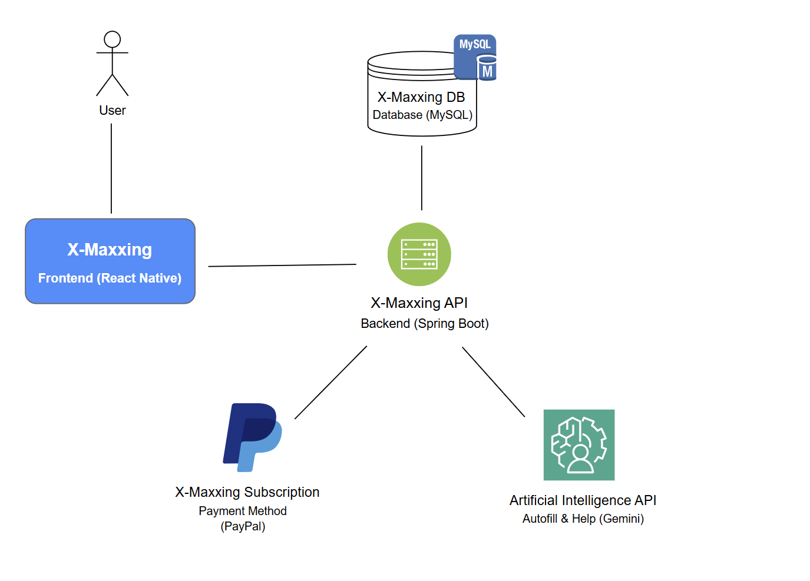
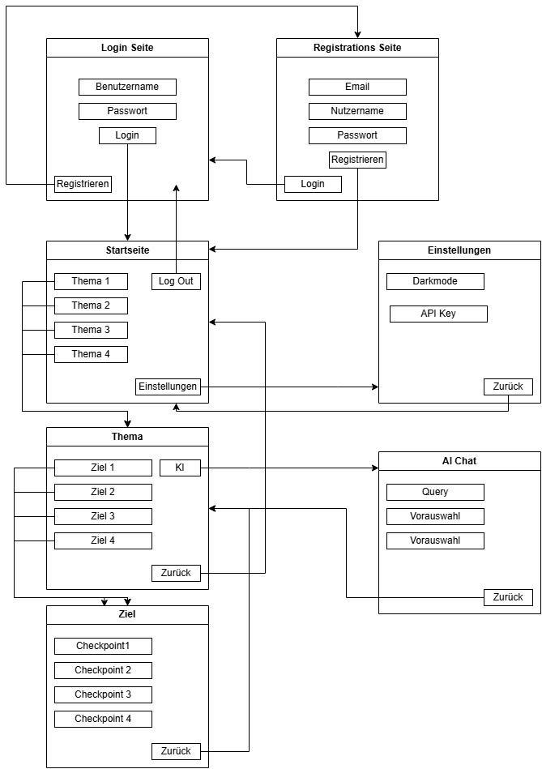

## 3. Systemarchitektur

### Modulbeschreibung

#### Frontend (React Native Expo)

- Zuständig für die Benutzeroberfläche
- Kommuniziert mit der Backend API über HTTP
- Unterstützt Light-/Dark-Mode
- Stellt Diagramme und Fortschrittsvisualisierungen dar

#### Backend API (Spring Boot)

- Verwaltet Geschäftslogik und Benutzerverwaltung
- Bietet REST-Endpoints für das Frontend
- Kommuniziert mit der MySQL-Datenbank
- Handhabt Authentifizierung und Autorisierung

#### Datenbank (MYSQL SQLite)

- Speichert Benutzer, Ziele, Aufgaben und Fortschritte
- Enthält Tabellen für Transaktionen (Subscription-Zahlungen)

#### Zahlungsmethoden (PayPal, Stripe o.ä.)

- Handhabt In-App-Käufe und Subscription-Zahlungen
- Kommuniziert über eine sichere API mit dem Backend

#### Gemini AI API Calls

- Dient zur Unterstützung der Nutzer beim Erstellen von Zielen
- Wird vom Backend angesteuert

### 3.1 Systemübersicht

### 3.2 Gliederung der Lösung

### 3.3 Technische Schnittstellen

#### 3.3.1 API-Schnittstelle

Wir werden eine Schnittstelle implementieren, welche mit dem User bereitgestellten Gemini Api Key beliebige Querys schicken kann oder vordefinierte Querys wählen kann wie zb. "Fasse meinen Fortschritt zusammen". Es wird per API-Aufruf eine Anfrage an den Gemini-Dienst gesendet. Dieser Aufruf kann zb. JSON Formatierte Informationen zum User Fortschritt haben.

Die Antwort des Dienstes wird anschließend verarbeitet und dem Nutzer in einer strukturierten Form präsentiert.

Zusätzlich wird darauf geachtet, dass Sicherheitsaspekte wie die geschützte Speicherung des API-Keys und die Begrenzung der API-Anfragen berücksichtigt werden, um eine sichere und stabile Nutzung der Schnittstelle zu gewährleisten.

### 3.4 Benutzerschnittstelle

## 4. Testkonzept - (Testen anhand von User Stories)

| Abgedeckte User Stories | Beschreibung | Testfallbeschreibung |
|------------------------|--------------|---------------------|
| 1. Als Nutzer möchte ich Hauptbereiche wie Fitness, Schule oder Business erstellen und verwalten, um meine Organisation zu verbessern. | Testen der Funktionalität zum Erstellen, Umbenennen und Löschen von Hauptbereichen | Erstellen eines Hauptbereichs "Fitness", Umbenennen in "Training", Löschen des Bereichs |
| 2. Als Nutzer möchte ich für jeden Hauptbereich spezifische Unterbereiche erstellen, um meine Ziele gezielter verfolgen zu können. | Testen der Funktionalität zum Erstellen, Umbenennen und Löschen von Unterbereichen | Erstellen eines Unterbereichs "Kraft" für den Hauptbereich "Fitness", Umbenennen und Löschen |
| 3. Als Nutzer möchte ich Aufgaben und Ziele für jeden Unterbereich definieren, um meine Fortschritte aktiv zu gestalten. | Testen der Funktionalität zum Erstellen und Festlegen von Aufgaben für Unterbereiche | Erstellen der Aufgabe "Dreimal pro Woche Bankdrücken" im Unterbereich "Kraft" |
| 4. Als Nutzer möchte ich meinen Fortschritt in Form eines Levelsystems sehen, um meine Entwicklung nachvollziehen zu können. | Testen der Funktionalität des Levelsystems bei Erreichen von 100% Fortschritt | Erreichen von 100% in einem Ziel unter "Fitness" und Überprüfung des Levelaufstiegs von Level 1 auf Level 2 |
| 5. Als Nutzer möchte ich Statistiken über meine Fortschritte einsehen, um meine Leistung zu analysieren. | Testen der Anzeige von Fortschrittsstatistiken | Anzeige einer Wochenstatistik für den Bereich "Fitness" und Überprüfung der Darstellung der erledigten Aufgaben als Diagramm |
| 6. Als Nutzer möchte ich meinen allgemeinen Fortschritt in allen Bereichen auf einen Blick erfassen. | Testen der Gesamtfortschrittsanzeige | Anzeige einer Grafik, die 60% globalen Fortschritt zeigt, und Überprüfung der Korrektheit der Anzeige |
| 7. Als Nutzer möchte ich Erinnerungen für meine Aufgaben erhalten, damit ich sie nicht vergesse. | Testen der Erinnerungserstellung und -benachrichtigung | Erstellen einer Erinnerung für die Aufgabe "Joggen gehen" und Testen der Benachrichtigung |
| 8. Als Nutzer möchte ich zwischen hellem und dunklem Modus wechseln, um meine Nutzungserfahrung anzupassen. | Testen der Wechselmöglichkeit zwischen hellem und dunklem Modus | Wechseln zwischen hell und dunkel im Einstellungsmenü und Überprüfung der Änderung des Farbschemas |
| 9. Als Nutzer kann ich Notizen hinzufügen, um wichtige Informationen zu speichern. | Testen der Funktionalität zum Erstellen und Speichern von Notizen | Erstellen einer Notiz mit Titel und Text und Überprüfung der korrekten Speicherung und Anzeige der Notiz |
| 10. Als neuer Nutzer kann ich mich registrieren, um die App nutzen zu können. | Testen der Registrierung und Anmeldung eines neuen Nutzers | Eingabe der E-Mail-Adresse und Passwort, Erstellen eines neuen Kontos und Überprüfung der erfolgreichen Anmeldung |
| 11. Als Nutzer möchte ich langfristige Ziele festlegen, um meine persönliche Entwicklung zu planen. | Testen der Erstellung und Verwaltung langfristiger Ziele | Erstellen des Ziels "10 km in unter 50 Minuten laufen" mit einer Deadline von sechs Monaten und Überprüfung der korrekten Zieldefinition |
